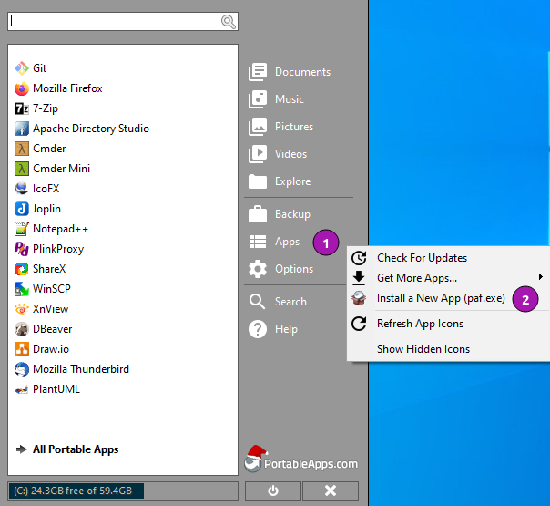
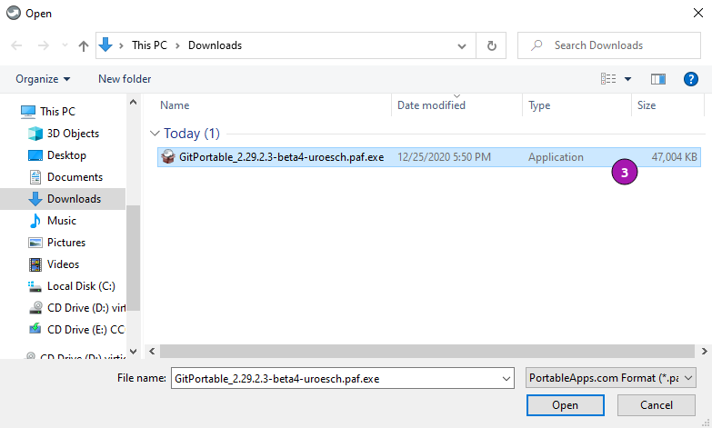
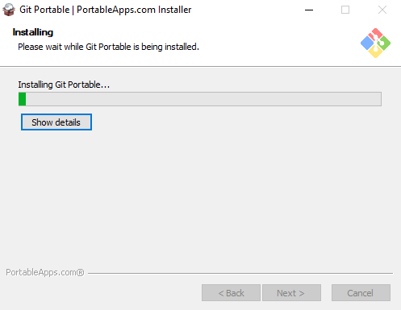
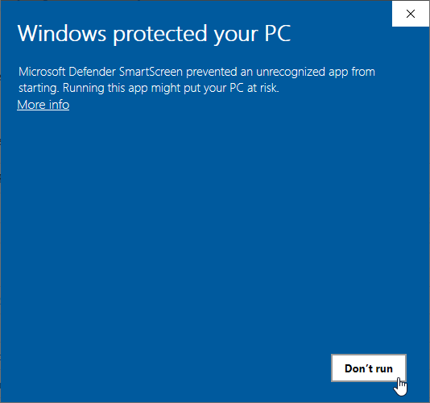
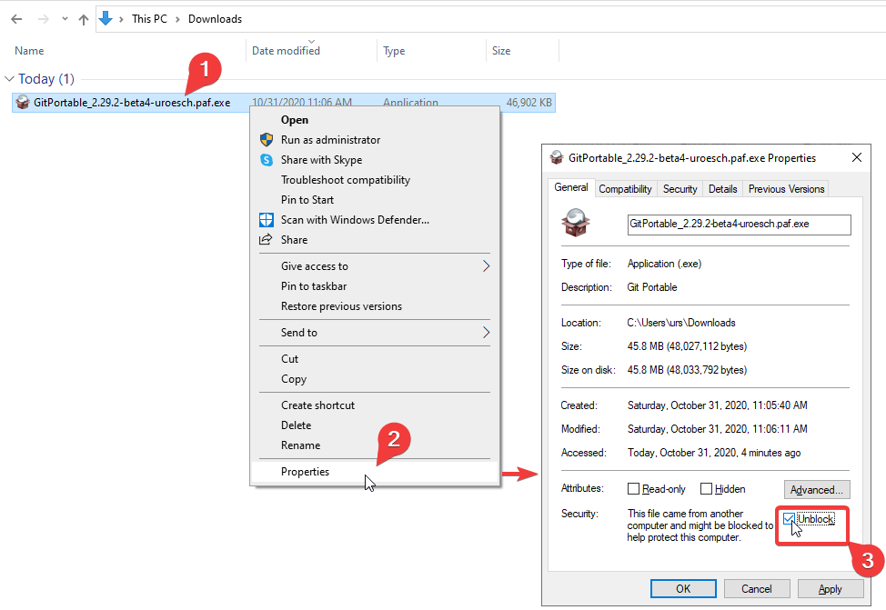

[](https://github.com/uroesch/LdapAdminPortable/actions?query=workflow%3Abuild-linux)
[](https://github.com/uroesch/LdapAdminPortable/actions?query=workflow%3Abuild-windows)
[](https://github.com/uroesch/LdapAdminPortable/releases)
[](#runtime-dependencies)


# LDAP Admin Portable for PortableApps.com


[Ldap Admin](http://www.ldapadmin.org/) is a free Windows LDAP client and
administration tool for LDAP directory management. This application lets
you browse, search, modify, create and delete objects on LDAP server. It
also supports more complex operations such as directory copy and move between
remote servers and extends the common edit functions to support specific
object types (such as groups and accounts).

You can use it to manage Posix groups and accounts, Samba accounts and it
even includes support for Postfix MTA. Ldap Admin is free Open Source
software distributed under the GNU General Public License.

## Runtime dependencies
* 32-bit or 64-bit version of Windows.

## Support matrix

| OS              | 32-bit             | 64-bit              |
|-----------------|:------------------:|:-------------------:|
| ReactOS 0.4.14\*| ![fs][fs]          | ![na][na]           |
| ReactOS 0.4.15\*| ![fs][fs]          | ![nd][nd]           |
| Windows XP      | ![fs][fs]          | ![nd][nd]           |
| Windows Vista   | ![fs][fs]          | ![fs][fs]           |
| Windows 7       | ![fs][fs]          | ![fs][fs]           |
| Windows 8       | ![fs][fs]          | ![fs][fs]           |
| Windows 10      | ![fs][fs]          | ![fs][fs]           |
| Windows 11      | ![na][na]          | ![fs][fs]           |

Legend: ![ns][ns] not supported; ![na][na] not applicable; ![nd][nd] no data; ![ps][ps] supported but not verified; ![fs][fs] verified;

\*) Starts up but throws error during LDAP query!

## Status
This PortableApps project has been tested when installed locally and on a cloud drive (Box).


<!-- Start include INSTALL.md -->
## Installation

### Download

Since this is not an official PortableApp the PortableApps installer must
be download first. Navigate to https://github.com/uroesch/LdapAdminPortable/releases
for a selection of releases.

### Install via the PortableApps.com Platform

After downloading the `.paf.exe` installer navigate to your PortableApps.com Platform
`Apps` Menu &#10102; and select `Install a new app (paf.exe)` &#10103;.



From the dialog choose the previously downloaded `.paf.exe` file. &#10104;



After a short while the installation dialog will appear.




### Install outside of the PortableApps.com Platform

The Packages found under the release page are not digitally signed so there the installation
is a bit involved.

After downloading the `.paf.exe` installer trying to install may result in a windows defender
warning.



To unblock the installer and install the application follow the annotated screenshot below.



1. Right click on the executable file.
2. Choose `Properties` at the bottom of the menu.
3. Check the unblock box.
<!-- End include INSTALL.md -->

<!-- Start include BUILD.md -->
### Build

#### Windows

##### Windows 10

The only supported build platform for Windows is version 10 other releases
have not been tested.

###### Clone repositories

```
git clone https://github.com/uroesch/PortableApps.comInstaller.git
git clone -b patched https://github.com/uroesch/PortableApps.comLauncher.git
git clone https://github.com/uroesch/LdapAdminPortable.git
```

###### Build installer

```
cd LdapAdminPortable
powershell -ExecutionPolicy ByPass -File Other/Update/Update.ps1
```

#### Linux

##### Docker

Note: This is currently the preferred way of building the PortableApps installer.

For a Docker build run the following command.

###### Clone repo

```
git clone https://github.com/uroesch/LdapAdminPortable.git
```

###### Build installer

```
cd LdapAdminPortable
curl -sJL https://raw.githubusercontent.com/uroesch/PortableApps/master/scripts/docker-build.sh | bash
```

#### Local build

##### Ubuntu 20.04

To build the installer under Ubuntu 20.04 `Wine`, `PowerShell`, `7-Zip` and when building headless
`Xvfb` are required.

###### Setup
```
sudo snap install powershell --classic
sudo apt --yes install git wine p7zip-full xvfb
```

When building headless run the below command starts a virtual Xserver required for the build to
succeed.

```
export DISPLAY=:7777
Xvfb ${DISPLAY} -ac &
```

###### Clone repositories

```
git clone https://github.com/uroesch/PortableApps.comInstaller.git
git clone -b patched https://github.com/uroesch/PortableApps.comLauncher.git
git clone https://github.com/uroesch/LdapAdminPortable.git
```

###### Build installer

```
cd LdapAdminPortable
pwsh Other/Update/Update.ps1
```

##### Ubuntu 18.04

To build the installer under Ubuntu 18.04 `Wine`, `PowerShell`, `7-Zip` and when building headless
`Xvfb` are required.

###### Setup
```
sudo snap install powershell --classic
sudo apt --yes install git p7zip-full xvfb
sudo dpkg --add-architecture i386
sudo apt update
sudo apt --yes install wine32
```

When building headless run the below command starts a virtual Xserver required for the build to
succeed.

```
export DISPLAY=:7777
Xvfb ${DISPLAY} -ac &
```

###### Clone repositories

```
git clone https://github.com/uroesch/PortableApps.comInstaller.git
git clone -b patched https://github.com/uroesch/PortableApps.comLauncher.git
git clone https://github.com/uroesch/LdapAdminPortable.git
```

###### Build installer

```
cd LdapAdminPortable
pwsh Other/Update/Update.ps1
```
<!-- End include BUILD.md -->

[nd]: Other/Icons/no_data.svg
[na]: Other/Icons/not_applicable.svg
[ns]: Other/Icons/no_support.svg
[ps]: Other/Icons/probably_supported.svg
[fs]: Other/Icons/full_support.svg
